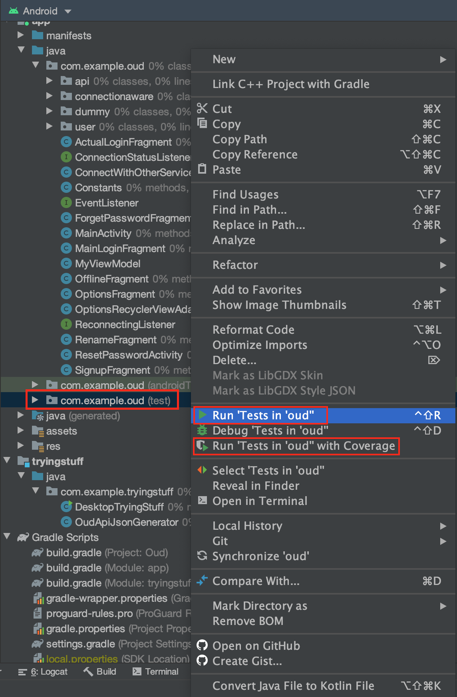

# Oud
 
## How to start ?
1) Install Android Studio.
2) Import project & let gradle do its magic!!

## How to run the app using our mock server ?
1) Install node.js.
2) Install json-server. `npm install -g json-server` or head to their github page for more detailes. https://github.com/typicode/json-server
3) Change the local ip address of you machine to `192.168.1.3`. Or you can alternatively open `Constants` class and change a constat called `YAMANI_MOCK_BASE_URL` to match your local ip. Make sure to also change the port number in this constant if you changed the default one when running the server.
4) Open `json-server` folder (exits in `develop` branch) in the terminal & copy paste the command found in `terminal_command.txt` file (exits in `json-server` folder) in your terminal window to run the server.
- make sure that private networks is allowed. (This depends on your os)

## How to run the app using the real server ?
- Simply change a constant named `MOCK` (inside `Constants` class) to `false`.

## How to run unit tests ?
1) Write click on `oud.example.oud (test)` and choose `Run tests in Oud` or `Run test in Oud with coverage`.

## How to generate functional documentation ?
In Android Studio `Tools -> Generate JavaDoc...`
